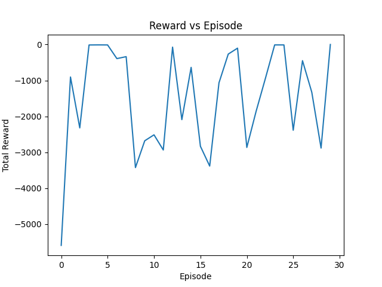
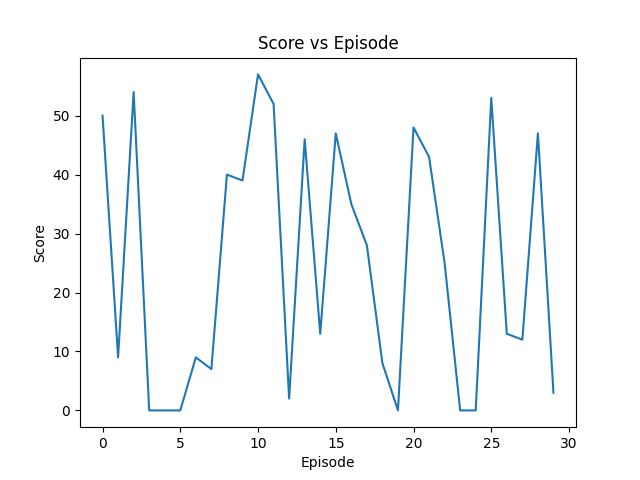

# Chubby Bird: A Custom Reinforcement Learning Environment with a Trained DQN Agent

A production-grade reinforcement learning project showcasing Deep Q-Network (DQN) training in a custom 2D game environment. This repository demonstrates the complete ML pipeline: problem formulation, state/reward design, agent training, and competitive gameplay.

## 🎮 Project Demo

[](https://youtu.be/2tcEPlWI3Kg "Click to play on YouTube")

Click the image to watch the trained DQN agent in action!

This video demonstrates the final trained agent interacting with the environment in real time.  
You can observe decision making, food collection behavior, gravity handling, and failure cases learned through reinforcement learning.

## 📊 Project Overview

**Chubby Bird** is not just a game—it's a reinforcement learning environment where an AI agent learns optimal decision-making through self-play. The agent learns to navigate a dynamic 2D space, collect time-sensitive targets, and maximize survival time.

### Problem Statement
- **Environment**: A 2D scrolling game with physics-based bird dynamics
- **Objective**: Train an AI agent to catch falling food objects while avoiding ground collision
- **Challenge**: Reward shaping and exploration-exploitation balance in a continuous action environment

### Key Results
- ✅ Agent learns to actively seek food (vs. passive survival strategies)
- ✅ Achieves consistent food collection rates after 50 episodes
- ✅ Beats untrained baseline in competitive gameplay
- ✅ Trains in ~10 minutes on CPU

---

## 🧠 The Reinforcement Learning Problem

### State Space (Observation)
The agent observes 4-dimensional state vector at each timestep:

```
State = [bird_y, bird_velocity, food_dx, food_dy]

• bird_y       : Bird's vertical position (normalized 0-1, 0=top, 1=bottom)
• bird_velocity: Current vertical velocity (normalized, range -1 to 1.5)
• food_dx      : Horizontal distance to nearest food (normalized -1 to 1)
• food_dy      : Vertical distance to nearest food (normalized -1 to 1)
```

**Design Rationale**: This minimal 4D representation captures the essential control problem—vertical positioning and proximity awareness—without computational overhead.

### Action Space (Control)
The agent has 2 discrete actions:

```
action = 0: Do nothing (gravity pulls bird down)
action = 1: Flap wings (apply upward impulse)
```

**Design Rationale**: Simple binary control mimics Flappy Bird constraints while remaining Markovian and deterministic.

### Reward Design (Engineering Focus)
The reward function was carefully engineered to avoid local optima and reward hacking:

| Trigger | Reward | Purpose |
|---------|--------|---------|
| Collect food | +10.0 | Primary objective |
| Miss food (escape) | -2.0 | Penalize inaction |
| In safe middle region | +0.1 | Exploration incentive |
| At top of screen | -2.0 | Force downward diversity |
| Near ground | -0.5 | Discourage reckless play |
| Within 100px of food | +0.05 | Proximity guidance |
| Per step | -0.005 | Efficiency penalty |

**Critical Engineering Decisions:**

1. **No inflated proximity bonus** - Removed +0.5/step bonus (agent hovered near food without catching it)
2. **Only reward actual catches** - Not generic "moving toward" (eliminated false positives)
3. **Random spawn positions** - Prevents overfitting to starting in middle
4. **Score-based model saving** - Save on food caught, not total reward (prevents reward gaming)

---

## 🤖 Agent Architecture

### DQN Implementation
```
Deep Q-Network (DQN) Architecture:
━━━━━━━━━━━━━━━━━━━━━━━━━━━━━━━━
Input Layer:     4 neurons (state dimensions)
Hidden Layer 1:  128 neurons + ReLU activation
Hidden Layer 2:  128 neurons + ReLU activation
Output Layer:    2 neurons (Q-values per action)
```

### Training Configuration
```python
Episodes:               50
Max steps/episode:      3000
Learning rate:          0.001 (Adam optimizer)
Discount factor (γ):    0.99
Epsilon decay:          0.98 per episode (slower exploration decay)
Epsilon min:            0.10 (maintain 10% exploration)
Batch size:             64
Memory buffer:          5000 experiences
Target update freq:     200 steps
```

### Stabilization Techniques
1. **Target Network Freezing**: Separate frozen target network updated every 200 steps (prevents feedback loops)
2. **Gradient Clipping**: `clip_grad_norm_(max_norm=1.0)` (prevents exploding gradients)
3. **Experience Replay**: Mini-batch SGD from randomized memory buffer (breaks temporal correlations)

---

## 🎮 System Architecture Diagram

```
┌─────────────────────────────────────────────────────────────┐
│                      GAME LOOP (60 FPS)                      │
└─────────────────────────────────────────────────────────────┘
                              │
                              ▼
                    ┌──────────────────┐
                    │  Get Game State  │
                    │  [y,v,dx,dy]     │
                    └──────────────────┘
                              │
                              ▼
              ┌───────────────────────────────┐
              │  DQN Agent (Inference Mode)   │
              │  • Forward pass through net   │
              │  • Q(s,a) = [Q_nothing,Q_flap]│
              │  • action = argmax(Q-values)  │
              └───────────────────────────────┘
                              │
                              ▼
                    ┌──────────────────┐
                    │  Execute Action  │
                    │  Physics update  │
                    └──────────────────┘
                              │
                              ▼
        ┌─────────────────────────────────────┐
        │  Observe: Reward + Next State       │
        │  • Food collision? +10              │
        │  • Food escaped? -2                 │
        │  • New state: [y',v',dx',dy']       │
        └─────────────────────────────────────┘
                              │
                              ▼
        ┌─────────────────────────────────────┐
        │ Store Transition in Memory          │
        │ (state, action, reward, next_state) │
        └─────────────────────────────────────┘
                              │
                              ▼
        ┌─────────────────────────────────────┐
        │  Train on Mini-Batch (when ready)   │
        │  • Sample 64 transitions            │
        │  • Forward pass on current net      │
        │  • Compute target Q with frozen net │
        │  • MSE loss + backprop              │
        │  • Gradient clip + Adam step        │
        └─────────────────────────────────────┘
```

---

## 📈 Training Results

### Learning Performance

**Total Reward per Episode:**


The agent shows clear learning progression. Early episodes incur heavy exploration penalties (-5000 range), stabilizing as the agent learns efficient strategies.

**Food Collection Rate:**


Agent learns to catch 3-5 food items by episode 10 and maintains consistent performance by episode 25, demonstrating stable convergence.

---

## 🎯 Engineering Challenges & Solutions

| Challenge | Root Cause | Fix | Result |
|-----------|-----------|-----|--------|
| **Reward Hacking** | +0.5 proximity bonus caused hovering | Removed proximity bonus, reward only catching | Agent actively catches food |
| **Stuck in Local Optima** | ε decay 0.999/ep → 0.01 in 7 eps | Changed to 0.98/ep, maintains 0.10 floor | Agent explores all regions |
| **Training Instability** | No gradient clipping, freq updates | Added clip_grad_norm(1.0), 200-step targets | Stable convergence |
| **Poor Generalization** | Always spawn at middle (y=0.5) | Random spawn [50px, height-100px] | Robust at any position |
| **Distribution Shift** | Model assumes middle-start position | Randomize bird Y during training | Handles diverse initial states |

### Key Engineering Decisions Explained

**Reward Shaping Pitfall**: Initial +0.5/step bonus for being "close to food" caused reward hacking—agent learned to hover near targets for points without actually catching them. Solution: Only reward terminal actions (food catch +10, food escape -2).

**Exploration Decay**: Epsilon 0.999/step converged too fast, locking into "stay at top" strategy. Slower decay (0.98/episode) with 0.10 floor maintained 10% exploration throughout training, enabling discovery of diverse strategies.

**Gradient Stability**: No clipping caused exploding gradients during food-rich episodes. Clip_grad_norm(max_norm=1.0) prevented divergence while maintaining learning speed.

---

## 🚀 Usage

### Quick Start
```bash
# 1. Install dependencies
pip install -r requirements.txt

# 2. Play
python main.py
```

### Training Your Own Model
```bash
python train.py
# Trains for 50 episodes, saves assets/model/best_model.pth
# Shows live rendering during training (~15 min)
# Edit train.py config for faster headless training
```
---

## 🎮 Game Modes

### 1. Manual Play
- Control with **SPACEBAR** to flap
- Collect falling food for points
- Game ends on ground collision
- **Purpose**: Understand game mechanics

### 2. AI Play  
- Watch the trained agent play
- No user input
- Shows AI's decision-making in action
- **Purpose**: Verify training effectiveness

### 3. You vs AI
- Alternating turns: Player then AI
- Each player tries to catch as much food as possible
- First to 10 points wins
- **Purpose**: Competitive benchmark

---

## 📁 Project Structure

```
Chubby Bird/
├── main.py                    # Entry point
├── launcher.py                # Game mode router
├── train.py                   # DQN training script
├── requirements.txt           # Dependencies
├── assets/model/best_model.pth             # Trained agent weights
│
├── src/
│   ├── settings.py            # Game constants
│   ├── agent.py               # DQN model + training logic
│   ├── env.py                 # Training environment
│   ├── game.py                # Base game loop
│   ├── vs_game.py             # Competitive mode
│   ├── menu_simple.py         # Menu UI
│   ├── bird.py                # Physics + rendering
│   └── food.py                # Food spawning
│
└── assets/
    ├── images/                # Sprites & backgrounds
    └── sounds/                # Audio files
```

---

## 🔧 Quick Reference

### Training Configuration
| Parameter | Value | Purpose |
|-----------|-------|---------|
| Episodes | 50 | Total training runs |
| Max steps/episode | 3000 | Timeout per episode |
| Learning rate | 0.001 | Adam optimizer |
| Discount factor (γ) | 0.99 | Future reward weight |
| Epsilon decay | 0.98/ep | Exploration schedule |
| Epsilon min | 0.10 | Min exploration rate |
| Batch size | 64 | SGD mini-batch |
| Memory buffer | 5000 | Experience replay size |
| Target update | 200 steps | Frozen network sync |

### Game Modes
- **Manual Play**: Control with SPACEBAR
- **AI Play**: Watch trained agent
- **You vs AI**: Competitive mode (first to 10 wins)

---

## 📚 What This Demonstrates

✅ Deep Q-Learning (DQN)  
✅ Experience replay & target networks  
✅ Reward shaping in practice  
✅ Hyperparameter tuning  
✅ Agent evaluation metrics  
✅ Competitive benchmarking  

---

## 👨‍💻 Author

**Mansoor Bukhari**
- GitHub: [@cyberfantics](https://github.com/cyberfantics)
- LinkedIn: [linkedin.com/in/mansoor-bukhari](https://linkedin.com/in/mansoor-bukhari)

---

## 📝 License

MIT License - Use freely for learning and development.

---

## 🙏 Acknowledgments

- Inspired by Flappy Bird and DQN paper ([Human-level control through deep RL](https://www.nature.com/articles/nature14236))
- Thanks to Pygame community for excellent documentation
- PyTorch team for intuitive deep learning APIs


---

